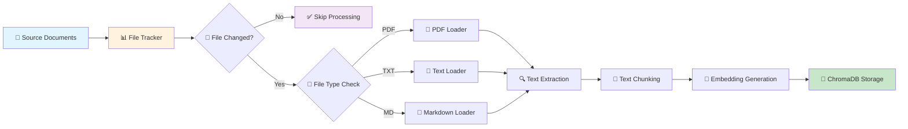

# RAG Demo - Document Q&A System

A Retrieval-Augmented Generation (RAG) system built with LangChain, ChromaDB, and Anthropic Claude LLM API. Features intelligent document indexing, incremental updates, and conversational AI.

## 🎯 Features

### Core Capabilities
- **📚 Smart Document Indexing** - PDF, TXT, and Markdown support with incremental updates
- **🔍 Semantic Search** - Vector-based similarity search with ChromaDB
- **🤖 AI-Powered Answers** - Contextual responses using Anthropic Claude
- **⚡ Incremental Updates** - Only re-index modified documents for efficiency
- **🗃️ File Tracking** - Built-in metadata tracking and change detection

### Other Features
- **🎛️ Centralized Configuration** - Easy customization via config files
- **🛡️ Error Handling** - Error handling and logging
- **🏗️ Modular Architecture** - Clean separation for maintainability

## 📊 Workflow Diagrams

### Ingestion Workflow



### RAG Query Workflow


## 🛠️ Tech Stack

- **Python** - Core programming language for the entire application
- **LangChain** - Framework for building LLM-powered applications and RAG pipelines
- **ChromaDB** - Vector database for storing and retrieving document embeddings. ChromaDB for its simplicity and ease of use in local deployments *(Other alternatives you could consider include Elasticsearch, MongoDB, Pinecone)*
- **Anthropic Claude API** - Large language model for generating contextual responses
- **PyPDF2** - PDF document processing and text extraction
- **Sentence Transformers** - Text embedding generation for semantic search

## 🏗️ Project Structure

```
rag-demo/
├── README.md                # This file
├── requirements.txt         # Python dependencies
├── .env                     # Environment variables (API keys)
├── setup.sh                 # Virtual environment setup script
├── common/                  # Shared utilities and configuration
│   ├── __init__.py
│   ├── config.py            # Centralized configuration
│   ├── utils.py             # Utility functions
│   └── vector_store.py      # ChromaDB wrapper
├── indexer/                 # Document indexing module
│   ├── __init__.py
│   ├── main.py              # Indexing CLI and logic
│   ├── document_loader.py   # PDF/text document loaders
│   ├── text_processor.py    # Text chunking and processing
│   └── file_tracker.py      # File change tracking
├── search/                  # Search and query module
│   ├── __init__.py
│   ├── main.py              # Search CLI and interface
│   └── rag_chain.py         # Claude AI integration
├── source_documents/        # Source documents directory
│   ├── *.pdf                # PDF documents
│   └── *.txt                # Text files
└── chroma_db/               # Vector database (auto-created)
    └── ...                  # ChromaDB persistence files
```

## 🚀 Quick Start

### Prerequisites
- Python 3.9+
- Anthropic API key (<a href="https://console.anthropic.com/" target="_blank">Get one here</a>)


### Installation

1. **Clone and setup:**
   ```bash
   git clone <repository-url>
   cd rag-langchain-demo
   chmod +x setup.sh && ./setup.sh
   ```

2. **Activate environment:**
   ```bash
   source rag-env/bin/activate
   ```

3. **Configure API key:**
   ```bash
   echo "ANTHROPIC_API_KEY=your_api_key_here" > .env
   ```

4. **Index your documents:**
   ```bash
   python -m indexer.main directory source_documents/
   ```

   **Example Indexer Commands:**
   ```bash
   # Index all your documents
   python -m indexer.main directory source_documents/
   
   # Index a single file
   python -m indexer.main file source_documents/sample_document.txt
   
   # Check index status
   python -m indexer.main status
   
   # Clear the index
   python -m indexer.main clear
   
   # Force re-index all documents
   python -m indexer.main force source_documents/
   ```


5. **Start querying:**
   ```bash
   python -m search.main ask "What is machine learning?"
   ```

   **Example Search Commands:**
   ```bash
   python -m search.main ask "What is machine learning?"
   python -m search.main ask "What is price of CHLORINATOR"
   ```


**Example SQLite Commands:**
   ```bash
   sqlite3 chroma_db/chroma.sqlite3
   
   # Inside SQLite:
   .tables              # Show all tables
   .schema              # Show table schemas
   SELECT name FROM sqlite_master WHERE type='table' order by name;  # List tables
   .quit                # Exit
   ```


## 🐛 Troubleshooting

### Common Issues

**1. API Key Errors**
```bash
# Error: Missing ANTHROPIC_API_KEY environment variable
echo "ANTHROPIC_API_KEY=your_key" > .env
```

**2. Import Errors**
```bash
# Ensure virtual environment is activated
source rag-env/bin/activate
pip install -r requirements.txt
```

**3. ChromaDB Issues**
```bash
# Clear database if corrupted
rm -rf chroma_db/
python -m indexer.main directory source_documents/
```

**4. No Search Results**
```bash
# Check if documents are indexed
python -m indexer.main status
```

### Debug Mode
Enable detailed logging by modifying `common/config.py`:
```python
APP_CONFIG = {
    "debug_mode": True,
    "log_level": "DEBUG"
}
```
